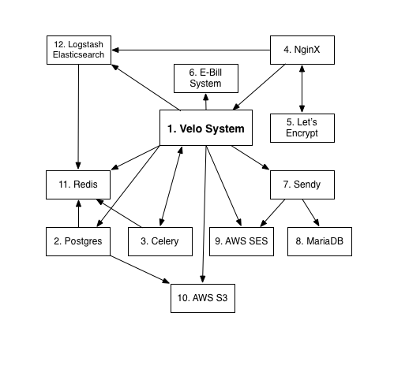

[](https://gemnasium.com/github.com/Ameriks/velo.lv)


Velo - Open source tool for bicycle competition management
=======
This is open source (GPLv3) web application to manage bicycle competitions (incl. applying, paying, start list generation, result showing).

Live website: https://velo.lv


## Architecture

System architecture consists of multiple different system that integrate together.



1.  Velo System - Core system what you can see in this repository.
2.  Postgres - System database.
3.  Celery - Task processing system.
4.  NginX - Really powerful webserver.
5.  Let's encrypt - SSL certificates from let's encrypt are used to provide SSL connection with webserver.
6.  E-bill system - Integration with banks is not included in this repository. Instead external system is used to manage credit card payments.
7.  Sendy - Sendy.co is used to send newsletters
8.  MariaDB - Sendy.co doesn't support Postgres, so we have MySQL database for that.
9.  AWS SES - All emails from system and newsletters are sent through AWS SES.
10. AWS S3 - All backups - live Postgres (wal-e) and static file backups are stored in S3.
11. Redis - Redis is used for Postgres log temporary storage, Celery queue management and for Velo System cache storage.
12. Logstash Elasticsearch - Is used for concatenating all logs from postgres, nginx and system. 


## Development environment setup

System is running in docker environment. So make sure you have latest Docker installed: https://docs.docker.com

Clone repository:
```
git clone https://github.com/Ameriks/velo.lv.git velo
```

First we need to initialize Postgres database: ```docker-compose -f dev.yml up postgres```

Execute all migration scripts: ```docker-compose -f dev.yml run django /app/manage.py migrate```

Start the application: ```docker-compose -f dev.yml up```

Website now is available in http://localhost:8000.

The default administrator access:
```
Email: admin@example.com
Password: admin
```
